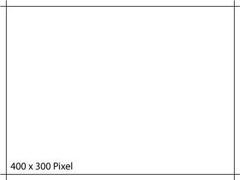

<p class="title">Type of Document</p>

Name of your paper

<table id="front-page-table">
    <tbody>
        <tr>
            <td>Authors</td>
            <td>Student 1<br>Student 2</td>
        </tr>
        <tr>
        	<td>Course</td>
        	<td>Computer science</td>   
        </tr>
        <tr>
        	<td>Supervised by</td>
        	<td>Supervisor 1<br>Supervisor 2</td>
        </tr>
        <tr>
        	<td>Customer</td>
        	<td>Name of the customer</td>   
        </tr>
        <tr>
        	<td>Place</td>
        	<td>Your Place</td>   
        </tr>
        <tr>
        	<td>Date</td>
        	<td>5th of November 2016</td>   
        </tr>
    </tbody>
</table>

<page-break/>

# Abstract

*TODO Summary*

<page-break/>

# Table of content

<ul class="leaders" id="toc"></ul>

<page-break/>

# Header Level 1
## Header Level 2
### Header Level 3
#### Header Level 4
##### Header Level 5

Lorem ipsum dolor sit amet, consetetur [First Citation](http://www.google.com "Description for the first citation"), sed diam nonumy eirmod tempor invidunt ut labore et dolore magna aliquyam erat, sed diam voluptua. At vero eos et accusam et justo duo dolores et ea rebum. Stet clita kasd gubergren, no sea takimata sanctus est Lorem ipsum dolor sit amet. Lorem ipsum dolor sit amet, consetetur sadipscing elitr, sed diam nonumy eirmod tempor invidunt ut labore et dolore magna aliquyam erat, sed diam voluptua. At vero eos et accusam et justo duo dolores et ea rebum. [Second Citation](http://apple.com "This is the description for the second citation") kasd gubergren, no sea takimata sanctus est Lorem ipsum dolor sit amet. Lorem ipsum dolor sit amet, consetetur sadipscing elitr, sed diam nonumy eirmod tempor invidunt ut labore et dolore magna aliquyam erat, sed diam voluptua. At vero eos et accusam et justo duo dolores et ea rebum. Stet clita kasd gubergren, no sea takimata sanctus est Lorem ipsum dolor sit amet.   

Duis autem vel eum iriure dolor in hendrerit in vulputate velit esse molestie consequat, vel illum dolore eu feugiat nulla facilisis at vero eros et accumsan et iusto odio dignissim qui blandit praesent luptatum zzril delenit augue duis dolore te feugait nulla facilisi. Lorem ipsum dolor sit amet, consectetuer adipiscing elit, sed diam nonummy nibh euismod tincidunt ut laoreet dolore magna aliquam erat volutpat.   

#### Header Level 4

Ut wisi enim ad minim veniam, quis nostrud exerci tation ullamcorper suscipit lobortis nisl ut aliquip ex ea commodo consequat. Duis autem vel eum iriure dolor in hendrerit in vulputate velit esse molestie consequat, vel illum dolore eu feugiat nulla facilisis at vero eros et accumsan et iusto odio dignissim qui blandit praesent luptatum zzril delenit augue duis dolore te feugait nulla facilisi.   

Nam liber tempor cum soluta nobis option congue nihil imperdiet doming id quod mazim placerat facer possim assum. Lorem ipsum dolor sit amet, consectetuer adipiscing elit, sed diam nonummy nibh euismod tincidunt ut laoreet dolore magna aliquam erat volutpat. Ut wisi enim ad minim veniam, quis nostrud exerci tation ullamcorper suscipit lobortis nisl ut aliquip ex ea commodo consequat.   

### Header Level 3

Duis autem vel eum iriure dolor in hendrerit in vulputate velit esse molestie consequat, vel illum dolore eu feugiat nulla facilisis.   

At vero eos et accusam et justo duo dolores et ea rebum. Stet clita kasd gubergren, no sea takimata sanctus est Lorem ipsum dolor sit amet. Lorem ipsum dolor sit amet, consetetur sadipscing elitr, sed diam nonumy eirmod tempor invidunt ut labore et dolore magna aliquyam erat, sed diam voluptua. At vero eos et accusam et justo duo dolores et ea rebum. Stet clita kasd gubergren, no sea takimata sanctus est Lorem ipsum dolor sit amet. Lorem ipsum dolor sit amet, consetetur sadipscing elitr, At accusam aliquyam diam diam dolore dolores duo eirmod eos erat, et nonumy sed tempor et et invidunt justo labore Stet clita ea et gubergren, kasd magna no rebum. sanctus sea sed takimata ut vero voluptua. est Lorem ipsum dolor sit amet. Lorem ipsum dolor sit amet, consetetur sadipscing elitr, sed diam nonumy eirmod tempor invidunt ut labore et dolore magna aliquyam erat.   


<h8>SVG 640 x 480 ( images/default.svg )</h8>

Consetetur sadipscing elitr, sed diam nonumy eirmod tempor invidunt ut labore et dolore magna aliquyam erat, sed diam voluptua. At vero eos et accusam et justo duo dolores et ea rebum. Stet clita kasd gubergren, no sea takimata sanctus est Lorem ipsum dolor sit amet. Lorem ipsum dolor sit amet, consetetur sadipscing elitr, sed diam nonumy eirmod tempor invidunt ut labore et dolore magna aliquyam erat, sed diam voluptua. At vero eos et accusam et justo duo dolores et ea rebum. Stet clita kasd gubergren, no sea takimata sanctus est Lorem ipsum dolor sit amet. Lorem ipsum dolor sit amet, consetetur sadipscing elitr, sed diam nonumy eirmod tempor invidunt ut labore et dolore magna aliquyam erat, sed diam voluptua. At vero eos et accusam et justo duo dolores et ea rebum. Stet clita kasd gubergren, no sea takimata sanctus.   

Lorem ipsum dolor sit amet, consetetur sadipscing elitr, sed diam nonumy eirmod tempor invidunt ut labore et dolore magna aliquyam erat, sed diam voluptua. At vero eos et accusam et justo duo dolores et ea rebum. [Stet clita kasd](http://www.tumblr.com "Citations are regular markdown links in the form [name](url description)") gubergren, no sea takimata sanctus est Lorem ipsum dolor sit amet. Lorem ipsum dolor sit amet, consetetur sadipscing elitr, sed diam nonumy eirmod tempor invidunt ut labore et dolore magna aliquyam erat, sed diam voluptua. At vero eos et accusam et justo duo dolores et ea rebum. Stet clita kasd gubergren, no sea takimata sanctus est Lorem ipsum dolor sit amet. Lorem ipsum dolor sit amet, [consetetur sadipscing](http://www.google.com "Lorem ipsum dolor sit amet, consetetur sadipscing elitr, sed diam nonumy eirmod tempor invidunt ut labore et dolore magna aliquyam erat, sed diam voluptua. At vero eos et accusam et justo duo dolores et ea rebum.") elitr, sed diam nonumy eirmod tempor invidunt ut labore et dolore magna aliquyam erat, sed diam voluptua. At vero eos et accusam et justo duo dolores et ea rebum. Stet clita kasd gubergren, no sea takimata sanctus est Lorem ipsum dolor sit amet.   

Duis autem vel eum iriure dolor in hendrerit in vulputate velit esse molestie consequat, vel illum dolore eu feugiat nulla facilisis at vero eros et accumsan et iusto odio dignissim qui blandit praesent luptatum zzril delenit augue duis dolore te feugait nulla facilisi. Lorem ipsum dolor sit amet, consectetuer adipiscing elit, sed diam nonummy nibh euismod tincidunt ut laoreet dolore magna aliquam erat volutpat.   

Ut wisi enim ad minim veniam, quis nostrud exerci tation ullamcorper suscipit lobortis nisl ut aliquip ex ea commodo consequat. Duis autem vel eum iriure dolor in hendrerit in vulputate velit esse molestie consequat, vel illum dolore eu feugiat nulla facilisis at vero eros et accumsan et iusto odio dignissim qui blandit praesent luptatum zzril delenit augue duis dolore te feugait nulla facilisi.   

Nam liber tempor cum soluta nobis eleifend option congue nihil imperdiet doming id quod mazim placerat facer possim assum. Lorem ipsum dolor sit amet, consectetuer adipiscing elit, sed diam nonummy nibh euismod tincidunt ut laoreet dolore magna aliquam erat volutpat. Ut wisi enim ad minim veniam, quis nostrud exerci tation ullamcorper suscipit lobortis nisl ut aliquip ex ea commodo

<page-break/>

# Tables

Lorem ipsum dolor sit amet, consetetur sadipscing elitr, sed diam nonumy eirmod tempor invidunt ut labore et dolore magna aliquyam erat, sed diam voluptua. At vero eos et accusam et justo duo dolores et ea rebum. Stet clita kasd gubergren, no sea takimata sanctus est Lorem ipsum dolor sit amet. Lorem ipsum dolor sit amet, consetetur sadipscing elitr, sed diam nonumy eirmod tempor invidunt ut labore et dolore magna aliquyam erat, sed diam voluptua. At vero eos et accusam et justo duo dolores et ea rebum. Stet clita kasd gubergren, no sea takimata sanctus est Lorem ipsum dolor sit amet.

## Markdown table

Option name         | Markup           | Result if enabled     |
--------------------|------------------|-----------------------|
Intra-word emphasis | So A\*maz\*ing   | So A<em>maz</em>ing   |
Underline [^under]  | \_So doge\_      | <u>So doge</u>        |
Quote [^quote]      | \"Such editor\"  | <q>Such editor</q>    |
Quote [^quote]      | \"Such editor\"  | <q>Such editor</q>    |
Quote [^quote]      | \"Such editor\"  | <q>Such editor</q>    |
Quote [^quote]      | \"Such editor\"  | <q>Such editor</q>    |
Quote [^quote]      | \"Such editor\"  | <q>Such editor</q>    |
Quote [^quote]      | \"Such editor\"  | <q>Such editor</q>    |
Quote [^quote]      | \"Such editor\"  | <q>Such editor</q>    |
Quote [^quote]      | \"Such editor\"  | <q>Such editor</q>    |
Quote [^quote]      | \"Such editor\"  | <q>Such editor</q>    |
Quote [^quote]      | \"Such editor\"  | <q>Such editor</q>    |
Quote [^quote]      | \"Such editor\"  | <q>Such editor</q>    |
Quote [^quote]      | \"Such editor\"  | <q>Such editor</q>    |
Quote [^quote]      | \"Such editor\"  | <q>Such editor</q>    |
Quote [^quote]      | \"Such editor\"  | <q>Such editor</q>    |
Quote [^quote]      | \"Such editor\"  | <q>Such editor</q>    |
Quote [^quote]      | \"Such editor\"  | <q>Such editor</q>    |
Quote [^quote]      | \"Such editor\"  | <q>Such editor</q>    |
Quote [^quote]      | \"Such editor\"  | <q>Such editor</q>    |
Quote [^quote]      | \"Such editor\"  | <q>Such editor</q>    |
Quote [^quote]      | \"Such editor\"  | <q>Such editor</q>    |
Quote [^quote]      | \"Such editor\"  | <q>Such editor</q>    |
Quote [^quote]      | \"Such editor\"  | <q>Such editor</q>    |
Quote [^quote]      | \"Such editor\"  | <q>Such editor</q>    |
Quote [^quote]      | \"Such editor\"  | <q>Such editor</q>    |
Quote [^quote]      | \"Such editor\"  | <q>Such editor</q>    |
Quote [^quote]      | \"Such editor\"  | <q>Such editor</q>    |
Quote [^quote]      | \"Such editor\"  | <q>Such editor</q>    |
Quote [^quote]      | \"Such editor\"  | <q>Such editor</q>    |
Quote [^quote]      | \"Such editor\"  | <q>Such editor</q>    |
Quote [^quote]      | \"Such editor\"  | <q>Such editor</q>    |

<h9>A really long markdown table that should overflow to the next page</h9>


## HTML table

<table >
    <tr>
        <th style="width:25%">Header Field 1</th>
        <th style="width:25%">Header Field 2</th>
        <th style="width:25%">Header Field 3</th>
        <th style="width:25%">Header Field 4</th>
    </tr>
    <tr>
        <td>
            Lorem ipsum dolor sit amet, consetetur sadipscing elitr, 
            sed diam nonumy eirmod tempor invidunt ut labore et 
            dolore magna aliquyam erat, sed diam voluptua. At vero 
            eos et accusam et justo duo dolores et ea rebum. 
            Stet clita kasd gubergren, no sea takimata 
            sanctus est Lorem ipsum dolor sit amet.
        </td>
        <td>
            Lorem ipsum dolor sit amet, consetetur sadipscing elitr, 
            sed diam nonumy eirmod tempor invidunt ut labore et dolore 
            magna aliquyam erat, sed diam voluptua.
        </td>
        <td>
            At vero eos et accusam et justo duo dolores et ea rebum. 
            Stet clita kasd gubergren, no sea takimata sanctus est 
            Lorem ipsum dolor sit amet.
        </td>
        <td>
            Consetetur sadipscing elitr, sed diam nonumy eirmod 
            tempor invidunt ut labore et dolore magna aliquyam erat, 
            sed diam voluptua. At vero eos et accusam et justo duo 
            dolores et ea rebum.
        </td>
    </tr>
</table>

<h9>An HTML-Table</h9>


# Image-Examples

## Native Markdown Images (SVG)


<h8>SVG 400x300 ( images/default-400-300.svg )</h8>


<h8>SVG 320x240 ( images/default-320-240.svg )</h8>

<page-break/>

## Native Markdown Images (JPG)


<h8>JPG 400x300 ( images/default.jpg )</h8>

## Image with a long description


<h8>Lorem ipsum dolor sit amet, consetetur sadipscing elitr, sed diam nonumy eirmod tempor invidunt ut labore et dolore magna aliquyam erat, sed diam voluptua. At vero eos et accusam et justo duo dolores et ea rebum. Stet clita kasd gubergren, no sea takimata sanctus est Lorem ipsum dolor sit amet.</h8>

<page-break/>

# Code-Examples

Lorem ipsum dolor sit amet, consetetur sadipscing elitr, sed diam nonumy eirmod tempor invidunt ut labore et dolore magna aliquyam erat, sed diam voluptua. At vero eos et accusam et justo duo dolores et ea rebum. Stet clita kasd gubergren, no sea takimata sanctus est Lorem ipsum dolor sit amet.

## Javascript

Here is some nice looking **Javascript**-Code:

```javascript
var a = "5 + 6";
eval(a);
```

<h7>Example-Code number one</h7>

Lorem ipsum dolor sit amet, consetetur sadipscing elitr, sed diam nonumy eirmod tempor invidunt ut labore et dolore magna aliquyam erat, sed diam voluptua. At vero eos et accusam et justo duo dolores et ea rebum. Stet clita kasd gubergren, no sea takimata sanctus est Lorem ipsum dolor sit amet.

## Python

Consetetur sadipscing elitr, sed diam nonumy eirmod tempor invidunt ut labore et dolore magna aliquyam erat, sed diam voluptua. At vero eos et accusam et justo duo dolores et ea rebum.
            
And here is some **Python**-code:

~~~python
print('Hello world!')
x = 1
if x == 1:
    # indented four spaces
    print "x is 1."
~~~

<h7>This describes the code above</h7>

Duis autem vel eum iriure dolor in hendrerit in vulputate velit esse molestie consequat, vel illum dolore eu feugiat nulla facilisis at vero eros et accumsan et iusto odio dignissim qui blandit praesent luptatum zzril delenit augue duis dolore te feugait nulla facilisi. Lorem ipsum dolor sit amet, consectetuer adipiscing elit, sed diam nonummy nibh euismod tincidunt ut laoreet dolore magna aliquam erat volutpat. 

## Ruby
Some longer Ruby code:

~~~ruby
#!/usr/bin/ruby

require 'sqlite3'

begin
    
    db = SQLite3::Database.new ":memory:"
    puts db.get_first_value 'SELECT SQLITE_VERSION()'
    
rescue SQLite3::Exception => e 
    
    puts "Exception occurred"
    puts e
    
ensure
    db.close if db
end
~~~

<h7>Lorem ipsum dolor sit amet, consetetur sadipscing elitr, sed diam nonumy eirmod tempor invidunt ut labore et dolore magna aliquyam erat, sed diam voluptua.</h7>

<page-break/>

# Bibliography

## References

<!--DO NOT EDIT - generated automatically!-->
<table id="citations">
</table>

## List of figures

<!--DO NOT EDIT - generated automatically!-->
<ul class="leaders" id="pictureDescriptions"></ul>

## List of tables

<!--DO NOT EDIT - generated automatically!-->
<ul class="leaders" id="tableDescriptions"></ul>

## List of code

<!--DO NOT EDIT - generated automatically!-->
<ul class="leaders" id="sourceDescriptions"></ul>

<page-break/>

# Appendix

- Appendix 1
- Appendix 2

<!--DO NOT EDIT - generates Table of contents and citations for the tags <h7>, <h8>, <h9>, <a> -->
<script>

// IMPORTENT:
// Anything done here to the DOM will be reflected 
// in the PDF-output of wkhtmltopdf

var h1Count = 0;
var h2Count = 0;
var h3Count = 0;
var h4Count = 0;
var h5Count = 0;

var toc = document.getElementById("toc");
var headers = document.querySelectorAll("h1, h2, h3, h4, h5");

for ( i = 0; i < headers.length ; i++ ) {

    var h = headers[i];
    
    //-----------------------------------
    // Do the enumeration for the Headers
    
    switch (h.tagName) {
    
        case "H1":
        
            // Exclude some elements from Enumeration
            if ( h.innerHTML == "Abstract" || 
                 h.innerHTML == "Table of content" ) { break; }
        
            h1Count += 1;
            h2Count = h3Count = h4Count = h5Count = 0;
            h.innerHTML = h1Count + ". " 
                        + h.innerHTML;
            break;
    
        case "H2":
            h2Count += 1;
            h3Count = h4Count = h5Count = 0;
            h.innerHTML = h1Count + "." 
                        + h2Count + ". " 
                        + h.innerHTML;
            break;
    
        case "H3":
            h3Count += 1;
            h4Count = h5Count = 0;
            h.innerHTML = h1Count + "." 
                        + h2Count + "." 
                        + h3Count + ". " 
                        + h.innerHTML;
            break;
            
        case "H4":
            h4Count += 1;
            h5Count = 0;
            h.innerHTML = h1Count + "." 
                        + h2Count + "." 
                        + h3Count + "." 
                        + h4Count + ". " 
                        + h.innerHTML;
            break;
            
        case "H5":
            h5Count += 1;
            h.innerHTML = h1Count + "." 
                        + h2Count + "." 
                        + h3Count + "." 
                        + h4Count + "." 
                        + h5Count + ". " 
                        + h.innerHTML;
            break;
            
        default:
    }
    
    //------------------------------  
    // Fill in the Table of contents
    
    if ( h.tagName == "H1" ) {
        toc.innerHTML += "<li style='margin-top:10px;'><span>" 
                        + h.innerHTML 
                        + "</span> <span>xx</span></li>\n";
    } else {    
        toc.innerHTML += "<li><span>" 
                        + h.innerHTML 
                        + "</span><span>xx</span></li>\n";
    }
    
}

//--------------------------------------
// Collector for citations in h7, h8, h9

function collectCitations(selector, outputID, prefix) {
    var count = 0;
    var selected = document.querySelectorAll(selector);
    var outputElement = document.getElementById(outputID);
    
    for ( i = 0; i < selected.length ; i++ ) {
        var s = selected[i];
        count += 1;
        var newDesc = prefix + count + ": " + s.innerHTML + " &zwnj;"; 
        // + " &zwnj;" fixes a problem, where wkhtmltopdf would add a line break before the last word on short descriptions
        s.innerHTML = newDesc;
        // Do the enumeration
        outputElement.innerHTML += "<li style='display:inline-block; width:100%;'><span>" 
                                + newDesc 
                                + "</span><span>xx</span></li><br>\n";
    }
}

collectCitations("h7","sourceDescriptions", "Source Code ");
collectCitations("h8","pictureDescriptions", "Figure ");
collectCitations("h9","tableDescriptions", "Table ");

//----------------------------------------------
// Get all citations (anchors <a>)

var anchorCount = 0;
var anchors = document.getElementsByTagName("a");
var citations = document.getElementById("citations");

for ( i = 0; i < anchors.length ; i++ ) {
    var a = anchors[i];
    anchorCount += 1;
    var newDesc = a.innerHTML + " [" + anchorCount + "]";
    a.innerHTML = newDesc;
    
    // Do the enumeration
    
    citations.innerHTML += "<tr><td>[" 
                        + anchorCount 
                        + "]</td><td>" 
                        + a.title 
                        + "</td></tr>";
}

</script>